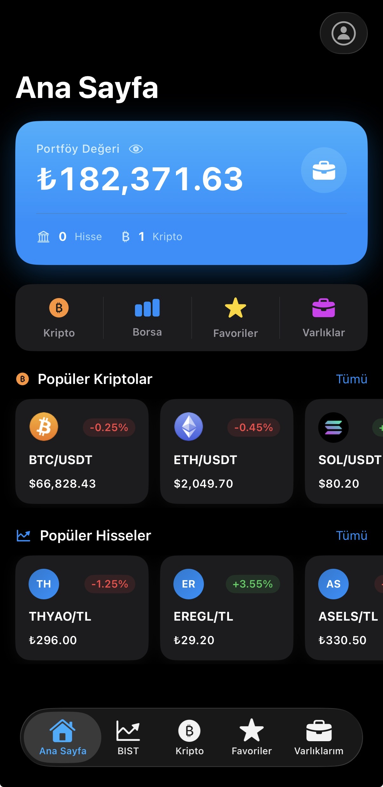
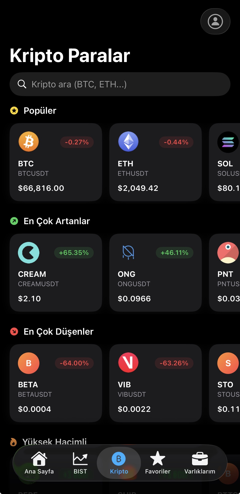
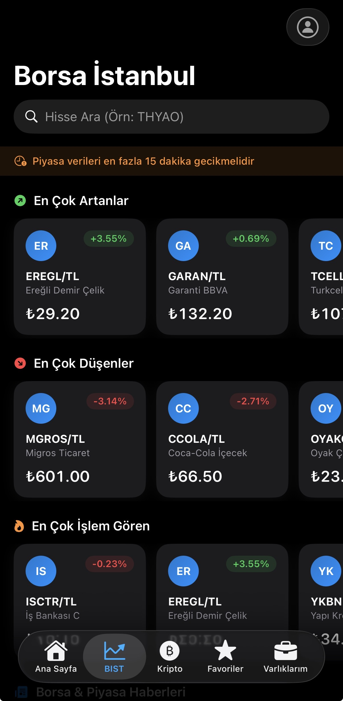
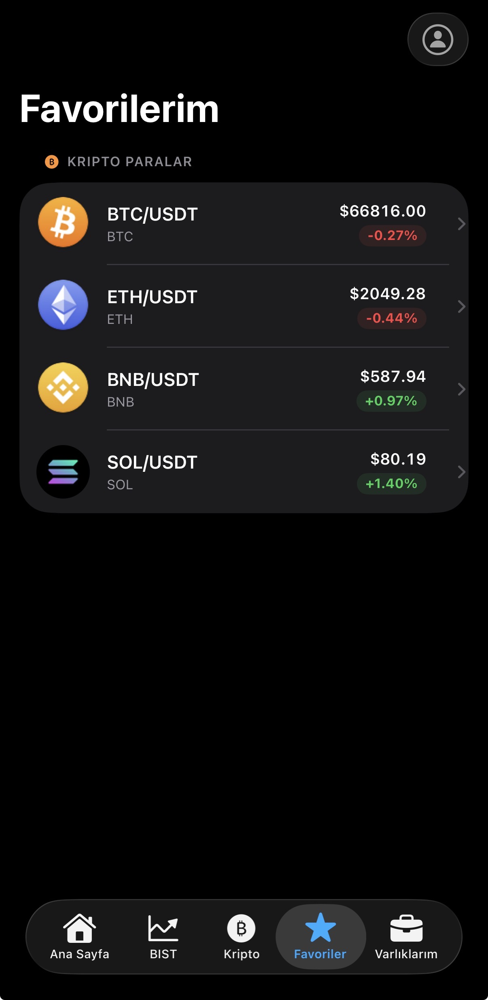
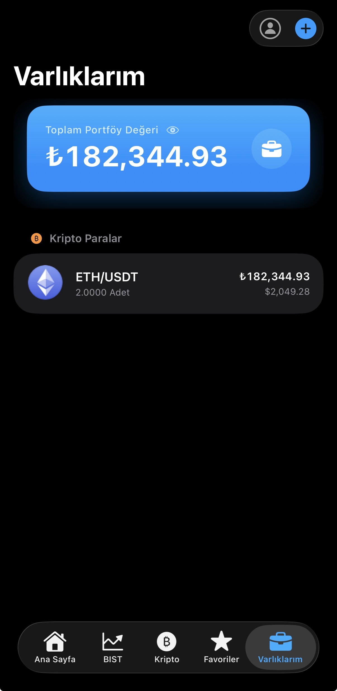
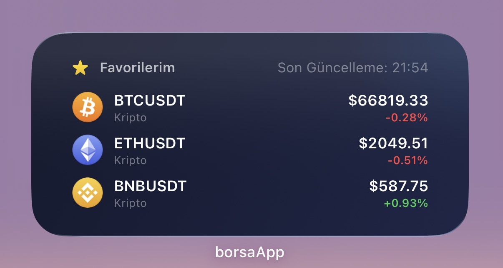
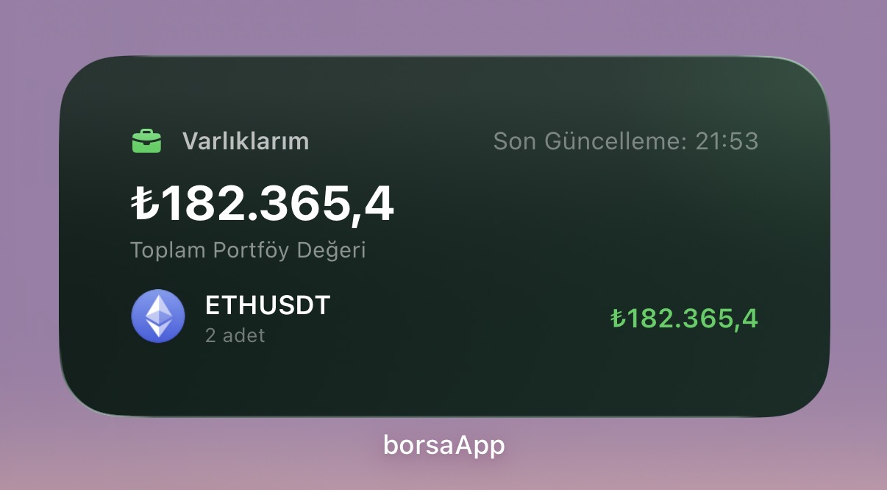
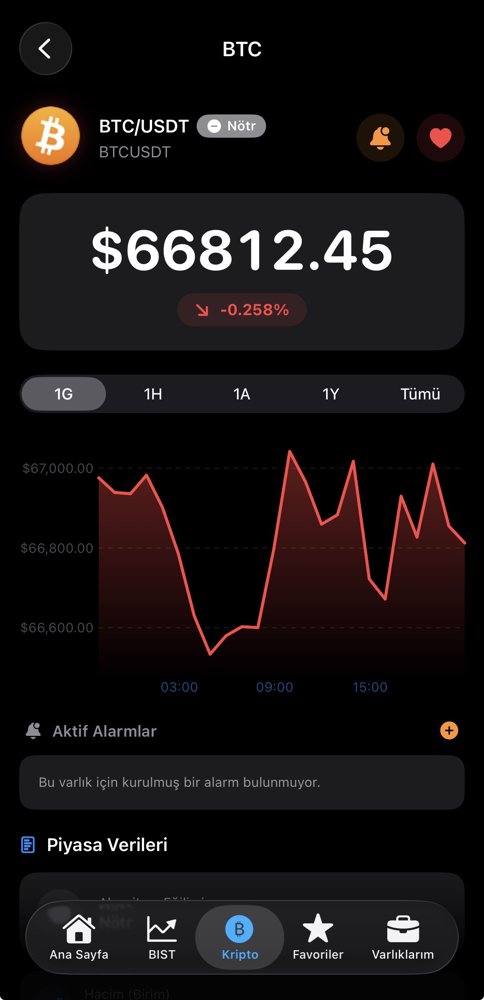

# 📈 BorsaApp - Detaylı Teknik Dokümantasyon

BorsaApp, Borsa İstanbul (BIST) ve Kripto Para piyasalarını tek bir çatı altında toplayan gerçek zamanlı veri takibi, portföy yönetimi ve akıllı alarm sistemine sahip modern bir iOS uygulamasıdır.

Bu proje, bir öğrenci proje ödevi titizliğinde hazırlanmış olup, modern iOS geliştirme teknolojilerinin gerçek dünya senaryolarındaki kullanımını göstermektedir.

  

---

## 🏗️ Mimari Yapı (Architecture)

Uygulamanın sürdürülebilir ve test edilebilir olması için **MVVM (Model-View-ViewModel)** mimari amaçlanmıştır. (Eksik yerleri var ancak genel mimari buna göre kurgulandı.)

- **Model:** Veri yapıları ve iş mantığı (Bist, Crypto, Alert modelleri).
- **View:** SwiftUI kullanılarak geliştirilen, tamamen veriye dayalı (State-driven) arayüz.
- **ViewModel:** View'ların ihtiyaç duyduğu veriyi hazırlayan, servislerle iletişime geçen ve arayüz mantığını (logic) yöneten katman.
- **Service-Oriented:** Her iş birimi (Hisse çekimi, Kripto çekimi, Alarmlar) kendi servis sınıfında (`BistService`, `CryptoService` vb.) izole edilmiştir.

---

## 🛠️ Teknoloji Yığını (Tech Stack)

- **Dil:** Swift 5.10 / 6.0
- **Arayüz:** SwiftUI
- **Asenkron Yapı:** Swift Concurrency (Async/Await) & Combine
- **Veri Paylaşımı:** App Groups (Shared UserDefaults)
- **Backend/Bağlantı:** 
    - **Firebase:** Google Auth
    - **Supabase:** PostgreSQL veritabanı senkronizasyonu
- **Veri Kaynakları:**
    - **Binance API:** Kripto verileri (REST & WebSocket)
    - **Yahoo Finance:** BIST hisse senedi verileri (REST)
    - **Coincap:** Kripto varlık logoları

---

## 📡 Veri Akış Yönetimi (Networking)

Burada **hibrit** bir yaklaşım kullanılmıştır.

### 1. Kripto Paralar (WebSocket & REST)
Kripto verilerinde hız kritik olduğu için Binance altyapısı kullanılmıştır.

  

- **REST API (`CryptoService`):** Uygulama ilk açıldığında tüm varlık listesini ve 24 saatlik değişimleri çekmek için kullanılır.
- **WebSocket (`WebSocketClient`):** `wss://stream.binance.com:9443/ws` adresi üzerinden Binance Ticker stream'ine bağlanır.
    - **Avantajı:** Sürekli HTTP isteği atmak yerine, sunucu fiyat değiştikçe bize "push" yapar. Bu sayede pil ömrü korunur ve veriler milisaniyelik gecikmeyle güncellenir.
    - **Mekanizma:** Combine (PassthroughSubject) kullanılarak yayın (broadcast) yapılır.

### 2. Borsa İstanbul (REST & Anti-Block)
Borsa İstanbul verileri Yahoo Finance üzerinden çekilir. 

  

- **Zorluk:** Yahoo, bot/scraping işlemlerini engellemek için sıkı bir "Rate Limit" ve "User-Agent" kontrolü uygular. Bunlara ek olarak ücretsiz bir API olduğu için verilerde 15 dakikalık gecikmeler sağlanabiliyor. Alternatif API'ler ücretli olduğu için mecburen Yahoo kullanmak zorunda kaldık.

- **Çözüm (`BistService`):**
    - **Dinamik Header:** İstekler gerçek bir MacOS tarayıcısından geliyormuş gibi taklit edilir (`User-Agent` & `Referer`).
    - **Multi-Endpoint:** Tek bir sunucu hata verirse, sırasıyla `query1`, `query2` ve `v7/v8/v10` sürümleri arasında otomatik geçiş yapılır.

---

## 🔔 Alarm ve Bildirim Sistemi

Uygulamanın en gelişmiş özelliklerinden biri, fiyat hedefe ulaştığında kullanıcıya haber vermesidir.

### Yerel Bildirimler (Local Notifications)
- **Logic (`AlertService`):** Kullanıcı bir alarm kurduğunda bu veri yerel olarak saklanır.
- **Arka Plan Takibi:** Uygulama açıkken `Combine` üzerinden gelen fiyat akışı (`pricePublisher`) her saniye taranır. Fiyat hedefe ulaştığında `UNUserNotificationCenter` üzerinden bildirim tetiklenir.
- **Zengin Bildirimler:** Bildirim gönderilmeden önce varlığın logosu Coincap üzerinden indirilir ve bildirime **ek (attachment)** olarak eklenir. 

---

## 🎨 Kullanıcı Deneyimi ve İlk Katılım (UX/Onboarding)

### 1. Dinamik Onboarding (Tanıtım)
Kullanıcının uygulamayı ilk açtığında karşılaştığı, uygulamanın temel özelliklerini (Fiyat Takibi, Portföy, Alarmlar) animasyonlu görsellerle anlatan **5 sayfalık** bir giriş ekranıdır.
- **Tabview:** SwiftUI'ın `TabView` yapısı `PageTabViewStyle` ile kullanılarak akıcı bir sayfa geçişi sağlanmıştır.
- **Kalıcı Durum:** Kullanıcının bu ekranı görüp görmediği `@AppStorage` (UserDefaults) üzerinden takip edilir; bu sayede uygulama her açıldığında değil, sadece ilk kurulumda gösterilir.

### 2. Animasyonlu Splash Screen (Açılış)
Uygulama başlatılırken marka kimliğini öne çıkaran özel bir **Custom Splash View** kullanılmıştır.

  

- **Spring Animation:** Uygulama logosu "Spring" animasyonu ile yumuşak bir şekilde büyür ve bulanıklıktan (blur) netleşmeye geçer.
- **Bağlantı Kontrolü:** Uygulama, internet bağlantısı sağlanana kadar Splash ekranında bekleyerek kullanıcının senkronize olmayan verilere bakmasını önler.

---

## ⭐ Favoriler ve Portföy Yönetimi

Uygulama, kullanıcıların takibini kolaylaştırmak için gelişmiş listeleme ve yönetim araçları sunar.

  
  

---

## 📱 iOS Widget Senkronizasyonu (WidgetKit)

Widget'lar uygulamanın dışında ayrı bir process olarak çalışır. Uygulama kapalıyken Widget'ın verinin ne olduğunu bilmesi için **App Groups** kullanılır.

  
  

- **App Group ID:** `group.com.borsaapp.shared`
- **Senkronizasyon (`WidgetDataBridge`):** Ana uygulama her güncellendiğinde, "Favoriler" listesini günceller.
- **USD/TRY Normalizasyonu:** Farklı piyasaları (USD bazlı Kripto ve TRY bazlı BIST) aynı listede "en pahalıya göre" sıralamak için anlık döviz kuruyla çapraz hesaplama yapılır (Örn: 1 USD = 45 TRY). Bu hesaplanmış "Top 3" listesi paylaşımlı alana yazılır ve Widget tarafından okunur.

---

## 📊 Veri Görselleştirme (Swift Charts)

Fiyat geçmişini kullanıcıya anlamlı bir şekilde sunmak için Apple'ın güncel **Swift Charts** kütüphanesi kullanılmıştır.

  

- **Dinamik Grafikler:** 1 Günlük, 1 Haftalık ve 1 Aylık periyotlarda fiyat değişimleri çizgi grafiği (Line Chart) olarak gösterilir.
- **Uyarlanabilir Renkler:** Fiyatın açılış fiyatına göre artış veya azalış durumuna göre grafiğin rengi otomatik olarak yeşil veya kırmızıya döner.

---

## 💾 Veri Saklama ve Önbellekleme (Caching)

- **BIST Caching:** Yahoo Finance'in 429 (Too Many Requests) hatasını önlemek ve pil ömrünü korumak için BIST verileri 15 dakika boyunca bellekte önbelleğe alınır. (Zaten Yahoo verileri 15 dakikada bir yeniliyor bu sayede istek sayısını azaltıyoruz.)
- **UserDefaults:** Kullanıcı favorileri ve uygulama içi ayarlar, hızlı erişim için local disk üzerinde saklanır.
- **Firebase/Supabase Sync:** Kullanıcı hesabı varsa, favoriler ve portföy bulut üzerinden tüm cihazlarla senkronize edilir.

---

## 🎨 Kullanıcı Deneyimi (UX/Design)

- **Dark Mode Support:** Uygulama, iOS sistem temasına tam uyum sağlar. Özel renk paletleri (Dynamic Colors) hem açık hem koyu modda premium bir his verir.
- **Haptic Feedback:** Bir alarm tetiklendiğinde veya kritik butonlara basıldığında Taptic Engine kullanılarak dokunsal geri bildirim verilir.
- **Dinamik Fiyat Formatı:** Shiba Inu (SHIB) gibi çok düşük değerli varlıklar için 8 basamağa kadar dinamik ondalık desteği sunulmuştur.

---

## 🚀 Kurulum Notları

1. **Xcode:** Minimum v15.0 gereklidir.
2. **CocoaPods/SPM:** Firebase SDK'ları Swift Package Manager ile projeye dahildir.
3. **GoogleService-Info.plist:** Kendi Firebase projenizden bu dosyayı alıp `App/` klasörüne eklemelisiniz.
4. **App Group:** Xcode Target ayarlarından "Capabilities" sekmesine gelip `group.com.borsaapp.shared` grubunu aktifleştirmelisiniz.

---

*Bu proje, YZL 344 Mobil Programlama dersi için proje ödevi olarak hazırlanmıştır. Herhangi bir ticari amacı yoktur, veriler üzerinden yapılabilecek herhangi bir yatırım kullanıcı insiyatifindedir, sorumluluk tamamen kullanıcıya aittir.* 🧪
